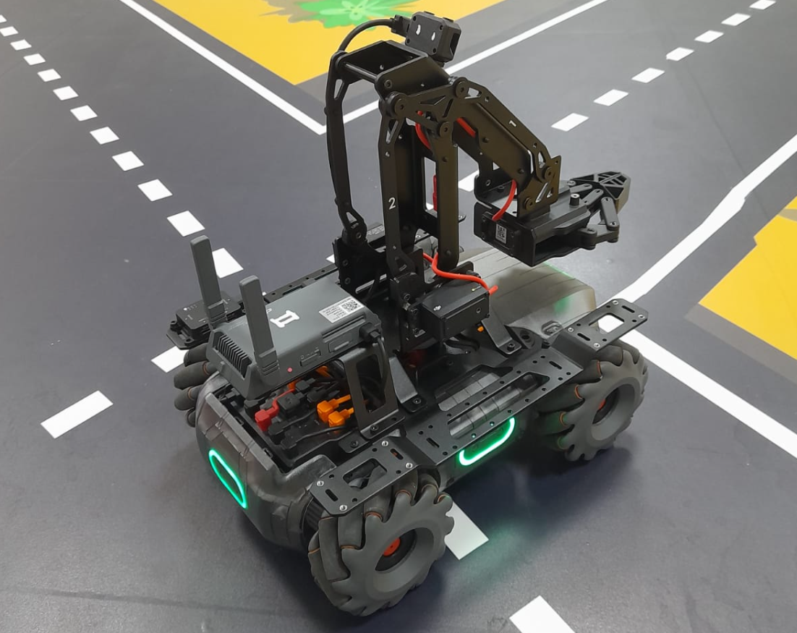

# MobileRobot-Openloopcontrol
## Aim:

To develop a python control code to move the mobilerobot along the predefined path.

## Equipments Required:
1. RoboMaster EP core
2. Python 3.7

## Procedure:

## Step1:

Use from robomaster import robot.

## Step2:

Choose the x,y,z - axis movement distance(meters).

## Step3:

Give ep_chassis.move to move straight.

## Step4:

Give time.sleep() for a break.

## Step5:

Give ep_chassis.drive_speed to have a circular movement.

## Program
```
### DEVELOPED BY : Sangeetha K
### REG NO : 212221230085

from robomaster import robot
import time

if _name_ == '_main_':
    ep_robot = robot.Robot()
    ep_robot.initialize(conn_type="ap")

    ep_chassis = ep_robot.chassis
    '''
    x = x-axis movement distance,( meters) [-5,5]
    y = y-axis movement distance,( meters) [-5,5]
    z = rotation about z axis ( degree)[-180,180]
    xy_speed = xy axis movement speed,( unit meter/second)  [0.5,2]

    '''
    ep_chassis.move(x=3, y=0, z=0, xy_speed=0.75).wait_for_completed()

    ep_chassis.move(x=0, y=0, z=55, xy_speed=1).wait_for_completed()

    ep_chassis.move(x=3, y=0, z=0, xy_speed=0.75).wait_for_completed()

    '''
    x = speed in x direction( meter/second) [-3.5,3.5]
    y = speed in y direction( meter/second) [-3.5,3.5]
    z = rotation about z axis ( degree/second)[-300,300]
    '''
    ep_chassis.drive_speed(x=0.4,y=0,z=-20)
    time.sleep(12)
    '''
    x = x-axis movement distance,( meters) [-5,5]
    y = y-axis movement distance,( meters) [-5,5]
    z = rotation about z axis ( degree)[-180,180]
    xy_speed = xy axis movement speed,( unit meter/second) [0.5,2]
    '''
    ep_chassis.move(x=3, y=0, z=0, xy_speed=0.75).wait_for_completed()
    '''
    x = speed in x direction( meter/second) [-3.5,3.5]
    y = speed in y direction( meter/second) [-3.5,3.5]
    z = rotation about z axis ( degree/second)[-300,300]
    '''
    ep_chassis.drive_speed(x=0,y=0,z=-2)
    time.sleep(5)
    
    ep_chassis.move(x=0, y=0, z=60, xy_speed=1).wait_for_completed()
    ep_chassis.move(x=1.4, y=0, z=0, xy_speed=0.75).wait_for_completed()
    ep_chassis.move(x=0, y=0, z=60, xy_speed=0.75).wait_for_completed()
    ep_chassis.move(x=0, y=0, z=0.5, xy_speed=0.75).wait_for_completed()
    ep_chassis.move(x=3, y=0, z=0, xy_speed=0.75).wait_for_completed()

```    
## MobileRobot Movement Image:



## MobileRobot Movement Video:

[](https://www.youtube.com/watch?v=XeVaMMl1iZU)


## Result:
Thus the python program code is developed to move the mobilerobot in the predefined path.


```
Mobile Robotics Laboratory
Department of Artificial Intelligence and Data Science/ Machine Learning
Saveetha Engineering College
```
